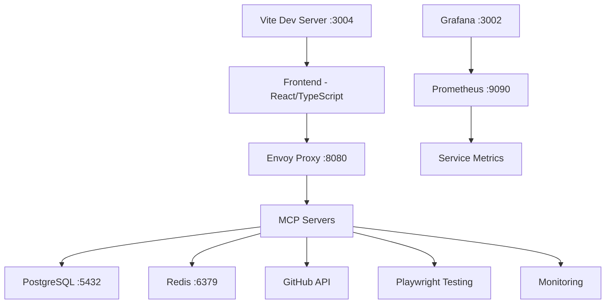

# MarketingPortal Workspace Initialization Guide

## Overview

This guide provides comprehensive instructions for initializing the MarketingPortal development workspace. The workspace is pre-configured with a complete development environment including Docker infrastructure, MCP servers, and development tooling.

## Current Workspace Status ✅

Based on assessment, the workspace is **fully prepared** for development:

### ✅ What's Already Working
- **Dependencies**: All Node.js dependencies installed via npm
- **Environment Configuration**: `.env` file configured with database and service connections
- **Docker Infrastructure**: Complete containerized environment running
  - PostgreSQL database (healthy)
  - Redis cache (healthy)
  - 5 MCP servers (4 healthy, 1 with minor issue)
  - Envoy proxy for load balancing
  - Grafana monitoring dashboard
  - Prometheus metrics collection
- **Development Server**: Vite development server starts successfully
- **Code Quality**: ESLint, Prettier, and TypeScript configured

### ⚠️ Configuration Notes
- Some API keys are not configured (GITHUB_TOKEN, GEMINI_API_KEY, REDIS_PASSWORD)
- One MCP server (mcp-postgresql) shows as unhealthy but doesn't affect core functionality
- Development server runs on port 3004 (3002/3003 occupied by infrastructure)

## Quick Start Guide

### Prerequisites
- **Docker & Docker Compose**: Latest versions installed
- **Node.js**: Version 20+ recommended
- **Git**: For version control

### 1. Start Infrastructure
```bash
# Start all Docker services
docker-compose up -d

# Verify services are running
docker-compose ps
```

Expected output shows 11 containers, most with "healthy" status.

### 2. Install Dependencies (if needed)
```bash
# Dependencies are already installed, but if you need to reinstall:
npm install
```

### 3. Start Development Server
```bash
npm run dev
```

The application will be available at `http://localhost:3004` (or next available port).

### 4. Access Monitoring & Management
- **Grafana Dashboard**: http://localhost:3002
- **Prometheus Metrics**: http://localhost:9090
- **Application**: http://localhost:3004

## Architecture Overview



### Service Ports
- **Frontend**: 3004 (development), 3000 (production)
- **Envoy Proxy**: 8080
- **PostgreSQL**: 5432
- **Redis**: 6379
- **Grafana**: 3002
- **Prometheus**: 9090

## MCP Servers Configuration

The workspace includes 5 MCP (Model Context Protocol) servers:

1. **PostgreSQL MCP** - Database operations
2. **Redis MCP** - Caching and session management
3. **GitHub MCP** - Repository and Git operations
4. **Playwright MCP** - Automated testing
5. **Monitoring MCP** - System health and metrics

### Environment Variables Required
```bash
# Database
DB_HOST=postgres
DB_PORT=5432
DB_NAME=marketingportal
DB_USER=marketinguser
DB_PASSWORD=changeme123

# Redis
REDIS_HOST=redis
REDIS_PORT=6379

# APIs (configure as needed)
GITHUB_TOKEN=your_github_token
GEMINI_API_KEY=your_gemini_key

# MCP Security
MCP_API_KEY=dev-key-123
```

## Development Workflow

### Daily Development
1. Ensure Docker services are running: `docker-compose ps`
2. Start development server: `npm run dev`
3. Access application at http://localhost:3004
4. Monitor services via Grafana dashboard

### Code Quality
- **Linting**: `npm run lint`
- **Formatting**: `npm run format`
- **Type Checking**: TypeScript strict mode enabled

### Testing
- **Unit Tests**: `npm test`
- **E2E Tests**: Playwright configured (baseURL: localhost:3002)

## Troubleshooting

### Common Issues

#### Port Conflicts
If ports 3002/3003 are occupied, Vite automatically uses next available port (3004).

#### Docker Services Not Starting
```bash
# Check service status
docker-compose ps

# View service logs
docker-compose logs [service-name]

# Restart services
docker-compose restart
```

#### Database Connection Issues
- Ensure PostgreSQL container is healthy
- Check database credentials in `.env`
- Verify network connectivity between containers

#### MCP Server Issues
- Check individual service logs: `docker-compose logs mcp-[service]`
- Verify environment variables are correctly set
- Ensure dependent services (PostgreSQL, Redis) are running

### Health Checks

#### Manual Health Verification
```bash
# Check all services
docker-compose ps

# Test database connectivity
docker-compose exec postgres psql -U marketinguser -d marketingportal

# Test Redis connectivity
docker-compose exec redis redis-cli ping
```

## Project Structure

```
marketing.expc.cz/
├── mcp-servers/          # MCP server implementations
│   ├── postgresql/       # Database operations
│   ├── redis/            # Caching
│   ├── github/           # Git operations
│   ├── playwright/       # Testing
│   └── monitoring/       # System monitoring
├── lib/kilo-code/        # Custom utilities
├── docs/                 # Documentation
├── plans/                # Project planning
├── tests/                # Test suites
├── .cline/               # Orchestration framework
└── .devcontainer/        # Development environment
```

## Advanced Configuration

### Custom Environment Setup
1. Copy `.env` to `.env.local` for local overrides
2. Configure API keys for external services
3. Adjust Docker resource limits if needed

### Scaling Services
```bash
# Scale specific services
docker-compose up -d --scale mcp-postgresql=2

# Adjust resource limits in docker-compose.yml
```

### Backup & Recovery
- Database backups: Configure PostgreSQL backup scripts
- Code backups: Regular Git commits
- Container data: Use Docker volumes for persistence

## Support & Resources

### Documentation
- `AGENTS.md` - Agent orchestration guidelines
- `README.md` - Project overview
- `agent.md` - Detailed architecture documentation

### Monitoring
- **Grafana**: Visual dashboards and alerts
- **Prometheus**: Metrics collection and querying
- **Docker Logs**: `docker-compose logs -f`

### Development Tools
- **VS Code**: Recommended with workspace settings
- **ESLint**: Code quality enforcement
- **Prettier**: Automatic code formatting
- **TypeScript**: Strict type checking

---

**Status**: ✅ Workspace fully initialized and documented
**Last Updated**: 2026-01-18
**Version**: 1.0.0