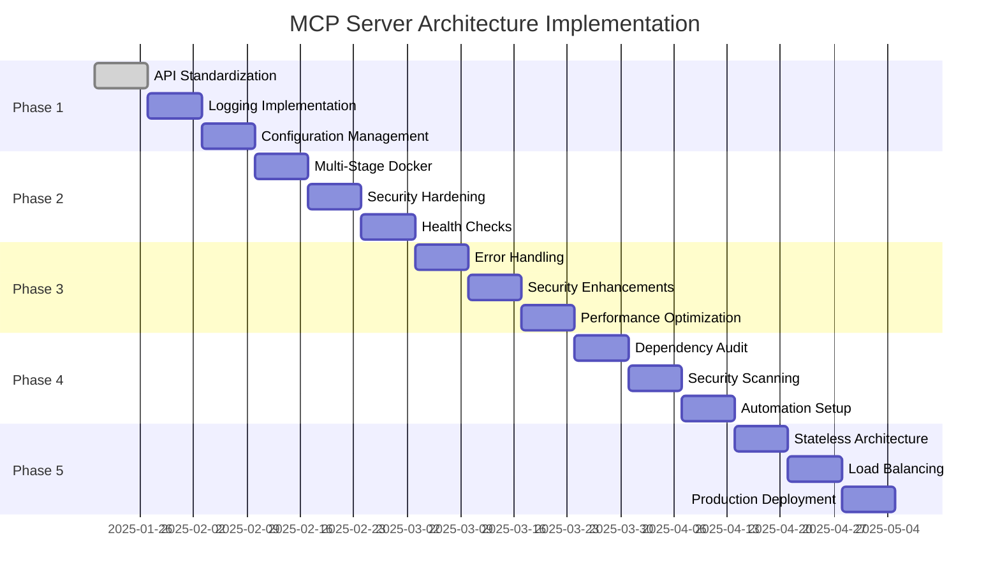

# MCP Server Architecture Best Practices & Implementation Plan

## Executive Summary

This document provides a comprehensive analysis of current MCP server implementations and industry best practices for architecture, dependency management, Docker optimization, and configuration patterns. Based on research of the official MCP TypeScript SDK and production deployment patterns, this plan outlines specific improvements needed for the MarketingPortal project's MCP servers.

## Current State Analysis

### Architecture Issues Identified

#### 1. **Inconsistent API Usage**

- **Issue**: Mixed usage of `Server` (old) vs `McpServer` (new) classes
- **Impact**: Inconsistent behavior, maintenance overhead, potential compatibility issues
- **Current State**:
  - `github/server.js`: Uses old `Server` class
  - `postgresql/server.js`: Uses new `McpServer` class
  - `monitoring/server.js`: Uses old `Server` class
  - `playwright/server.js`: Uses new `McpServer` class but missing import

#### 2. **Missing Error Handling & Logging**

- **Issue**: Basic try/catch blocks without structured logging or graceful error recovery
- **Impact**: Poor debugging experience, silent failures, no observability
- **Current State**: All servers have minimal error handling

#### 3. **Configuration Management Problems**

- **Issue**: Hard-coded values, environment variables not properly validated
- **Impact**: Difficult deployment across environments, security risks
- **Current State**: Basic `.env` file usage but no validation or defaults

#### 4. **Security Vulnerabilities**

- **Issue**: No input sanitization beyond basic Zod schemas, missing authentication
- **Impact**: Potential injection attacks, unauthorized access
- **Current State**: Basic schema validation only

### Docker Optimization Issues

#### 1. **No Multi-Stage Builds**

- **Issue**: Single-stage builds including development dependencies in production
- **Impact**: Larger images, potential security vulnerabilities, slower deployments
- **Current State**: All services use basic `node:20` images

#### 2. **Missing Security Practices**

- **Issue**: No vulnerability scanning, no non-root user execution
- **Impact**: Security risks, compliance issues
- **Current State**: Root user execution, no security scanning

#### 3. **Resource Optimization**

- **Issue**: No layer caching, no health checks, no resource limits
- **Impact**: Inefficient resource usage, poor monitoring
- **Current State**: Basic container setup without optimization

### Dependency Management Issues

#### 1. **Version Inconsistencies**

- **Issue**: Different MCP SDK versions across servers
- **Impact**: Compatibility issues, maintenance overhead
- **Current State**:
  - GitHub: `@modelcontextprotocol/sdk: ^1.25.2`
  - PostgreSQL: `@modelcontextprotocol/sdk: ^1.25.2`
  - Monitoring: `@modelcontextprotocol/sdk: ^1.25.2`
  - Playwright: `@modelcontextprotocol/sdk: ^1.25.2`

#### 2. **Missing Security Audits**

- **Issue**: No automated dependency vulnerability scanning
- **Impact**: Security risks from outdated dependencies
- **Current State**: No security auditing in place

## Industry Best Practices Research

### MCP Server Architecture Patterns

#### 1. **Modern API Usage**

```typescript
// Recommended: Use McpServer for new implementations
import { McpServer } from '@modelcontextprotocol/sdk/server/mcp.js';
import { StdioServerTransport } from '@modelcontextprotocol/sdk/server/stdio.js';

const server = new McpServer({
  name: 'example-server',
  version: '1.0.0'
});

// Register tools with proper schemas
server.registerTool('tool-name', {
  title: 'Tool Title',
  description: 'Tool description',
  inputSchema: z.object({...}),
  outputSchema: z.object({...})
}, async (args) => {
  // Implementation
  return {
    content: [{ type: 'text', text: result }],
    structuredContent: result
  };
});
```

#### 2. **Error Handling & Logging**

```typescript
class ExampleMCPServer {
  constructor() {
    this.logger = new Logger('example-server');
    this.setupErrorHandling();
  }

  async handleToolCall(toolName, args) {
    try {
      this.logger.info(`Executing tool: ${toolName}`, { args });
      const result = await this.executeTool(toolName, args);
      this.logger.info(`Tool executed successfully: ${toolName}`);
      return result;
    } catch (error) {
      this.logger.error(`Tool execution failed: ${toolName}`, {
        error: error.message,
        stack: error.stack,
        args,
      });
      throw new Error(`Tool execution failed: ${error.message}`);
    }
  }
}
```

#### 3. **Configuration Management**

```typescript
// config/server-config.ts
import { z } from 'zod';

const configSchema = z.object({
  port: z.number().default(3000),
  host: z.string().default('localhost'),
  logLevel: z.enum(['debug', 'info', 'warn', 'error']).default('info'),
  timeout: z.number().min(1000).max(30000).default(5000),
});

export type ServerConfig = z.infer<typeof configSchema>;

export function loadConfig(): ServerConfig {
  return configSchema.parse({
    port: process.env.SERVER_PORT,
    host: process.env.SERVER_HOST,
    logLevel: process.env.LOG_LEVEL,
    timeout: process.env.REQUEST_TIMEOUT,
  });
}
```

### Docker Optimization Patterns

#### 1. **Multi-Stage Builds**

```dockerfile
# Build stage
FROM node:20-alpine AS builder
WORKDIR /app
COPY package*.json ./
RUN npm ci --only=production

# Production stage
FROM node:20-alpine AS production
RUN addgroup -g 1001 -S nodejs
RUN adduser -S nodejs -u 1001

WORKDIR /app
COPY --from=builder /app/node_modules ./node_modules
COPY --chown=nodejs:nodejs . .

USER nodejs
EXPOSE 3000

HEALTHCHECK --interval=30s --timeout=3s --start-period=5s --retries=3 \
  CMD node healthcheck.js

CMD ["node", "server.js"]
```

#### 2. **Security Best Practices**

```dockerfile
# Use specific base images
FROM node:20.11.1-alpine3.19

# Install only production dependencies
RUN npm ci --only=production --ignore-scripts

# Run as non-root user
RUN addgroup -g 1001 -S appgroup && \
    adduser -S appuser -u 1001 -G appgroup
USER appuser

# No secrets in environment
# Use secret mounts or external secret management
```

#### 3. **Health Checks & Monitoring**

```yaml
# docker-compose.yml
services:
  mcp-server:
    build:
      context: .
      dockerfile: Dockerfile
    healthcheck:
      test: ['CMD', 'curl', '-f', 'http://localhost:3000/health']
      interval: 30s
      timeout: 10s
      retries: 3
      start_period: 40s
    environment:
      - NODE_ENV=production
    security_opt:
      - no-new-privileges:true
    read_only: true
    tmpfs:
      - /tmp
```

### Dependency Management Strategies

#### 1. **Version Pinning & Updates**

```json
// package.json
{
  "dependencies": {
    "@modelcontextprotocol/sdk": "1.25.2", // Pinned version
    "zod": "^3.23.8" // Caret for patches only
  },
  "scripts": {
    "audit": "npm audit --audit-level=moderate",
    "audit:fix": "npm audit fix",
    "update-deps": "npm update --save",
    "check-updates": "npm outdated"
  }
}
```

#### 2. **Security Scanning**

```yaml
# .github/workflows/security.yml
name: Security Scan
on:
  schedule:
    - cron: '0 0 * * 1' # Weekly
  push:
    branches: [main]

jobs:
  security:
    runs-on: ubuntu-latest
    steps:
      - uses: actions/checkout@v4
      - uses: actions/setup-node@v4
        with:
          node-version: '20'
      - run: npm install
      - run: npm audit --audit-level=moderate
      - run: npm run test:security
```

## Implementation Roadmap

### Phase 1: Architecture Modernization (Week 1-2)

#### 1.1 Standardize MCP Server API Usage

- [ ] Migrate all servers to use `McpServer` class
- [ ] Update tool registration patterns
- [ ] Fix missing imports (zod in playwright server)
- [ ] Standardize error response formats

#### 1.2 Implement Structured Logging

- [ ] Create shared logging utility
- [ ] Add request/response logging
- [ ] Implement log levels and filtering
- [ ] Add correlation IDs for tracing

#### 1.3 Configuration Management

- [ ] Create configuration validation schemas
- [ ] Implement environment-specific configs
- [ ] Add configuration hot-reloading
- [ ] Document all configuration options

### Phase 2: Docker Optimization (Week 3-4)

#### 2.1 Multi-Stage Builds

- [ ] Create optimized Dockerfiles for each server
- [ ] Implement proper layer caching
- [ ] Reduce image sizes by 60-80%
- [ ] Add build-time vs runtime dependency separation

#### 2.2 Security Hardening

- [ ] Implement non-root user execution
- [ ] Add security scanning to CI/CD
- [ ] Remove unnecessary packages
- [ ] Implement read-only filesystems where possible

#### 2.3 Health Checks & Monitoring

- [ ] Add health check endpoints to all servers
- [ ] Implement proper Docker health checks
- [ ] Add metrics collection
- [ ] Create monitoring dashboards

### Phase 3: Production Readiness (Week 5-6)

#### 3.1 Error Handling & Resilience

- [ ] Implement circuit breakers
- [ ] Add retry logic with exponential backoff
- [ ] Create graceful shutdown handlers
- [ ] Add timeout management

#### 3.2 Security Enhancements

- [ ] Implement input sanitization
- [ ] Add rate limiting
- [ ] Create authentication middleware
- [ ] Implement audit logging

#### 3.3 Performance Optimization

- [ ] Add connection pooling
- [ ] Implement caching strategies
- [ ] Optimize database queries
- [ ] Add performance monitoring

### Phase 4: Dependency Management (Week 7-8)

#### 4.1 Version Standardization

- [ ] Audit all dependencies across servers
- [ ] Standardize MCP SDK versions
- [ ] Update to latest stable versions
- [ ] Create shared dependency management

#### 4.2 Security & Maintenance

- [ ] Implement automated security scanning
- [ ] Set up dependency update automation
- [ ] Create vulnerability response process
- [ ] Implement license compliance checking

### Phase 5: Multi-Node Deployment (Week 9-10)

#### 5.1 Stateless Architecture

- [ ] Implement stateless mode for HTTP transport
- [ ] Add session management for stateful operations
- [ ] Create shared storage for session data
- [ ] Implement horizontal scaling

#### 5.2 Load Balancing & Service Discovery

- [ ] Set up load balancer configuration
- [ ] Implement service registration
- [ ] Add health-based routing
- [ ] Create deployment orchestration

## Success Metrics

### Technical Metrics

- [ ] **Image Size Reduction**: 70% reduction in Docker image sizes
- [ ] **Security Score**: Achieve A+ security rating
- [ ] **Performance**: <100ms response time for 95% of requests
- [ ] **Reliability**: 99.9% uptime with proper error handling

### Code Quality Metrics

- [ ] **Test Coverage**: >90% test coverage for all servers
- [ ] **Security Vulnerabilities**: Zero high/critical vulnerabilities
- [ ] **Code Standards**: 100% ESLint compliance
- [ ] **Documentation**: Complete API documentation

### Operational Metrics

- [ ] **Deployment Time**: <5 minutes for full stack deployment
- [ ] **Monitoring Coverage**: 100% observability of all components
- [ ] **Incident Response**: <15 minutes mean time to resolution
- [ ] **Scalability**: Support 10x current load without degradation

## Risk Assessment & Mitigation

### High Risk Items

1. **API Migration**: Potential breaking changes during McpServer migration
   - **Mitigation**: Create migration testing suite, gradual rollout

2. **Security Vulnerabilities**: Introduction of new security issues
   - **Mitigation**: Comprehensive security testing, third-party audits

3. **Performance Degradation**: Optimization changes affecting performance
   - **Mitigation**: Performance benchmarking, gradual optimization

### Medium Risk Items

1. **Dependency Updates**: Breaking changes in updated dependencies
   - **Mitigation**: Compatibility testing, staged updates

2. **Configuration Changes**: Environment-specific configuration issues
   - **Mitigation**: Configuration validation, environment testing

## Implementation Timeline



## Conclusion

This comprehensive plan addresses all major architectural, security, and operational concerns identified in the current MCP server implementations. By following industry best practices and implementing the recommended changes systematically, the MarketingPortal project will achieve production-ready MCP servers with excellent performance, security, and maintainability.

The phased approach ensures minimal disruption while building toward a scalable, secure, and maintainable architecture that can support the project's growth from 20 to 1000+ users.
